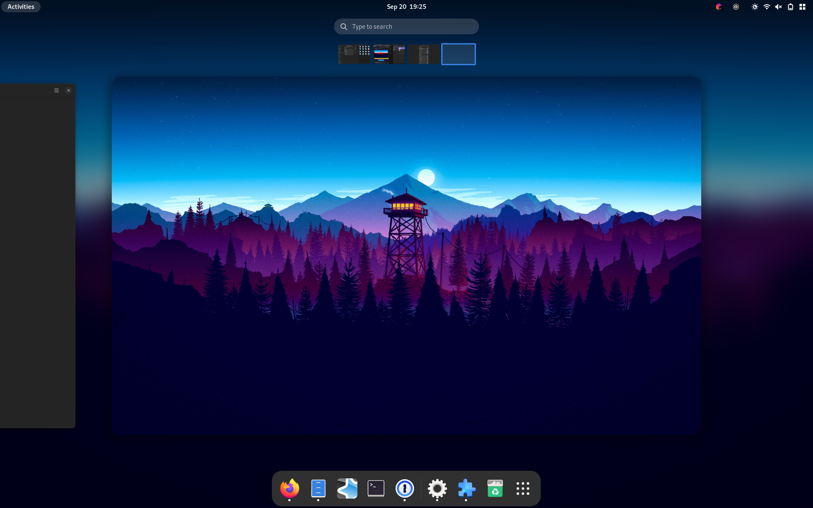
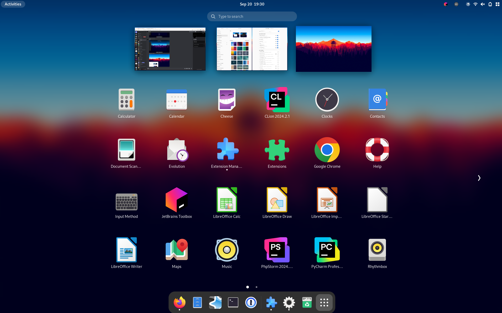
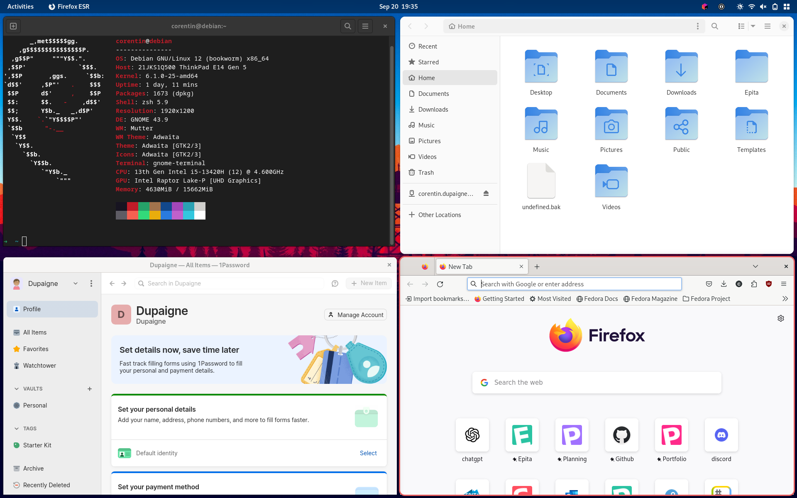
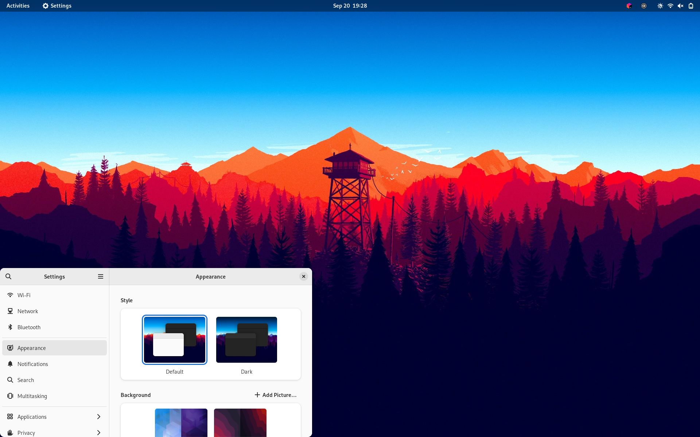
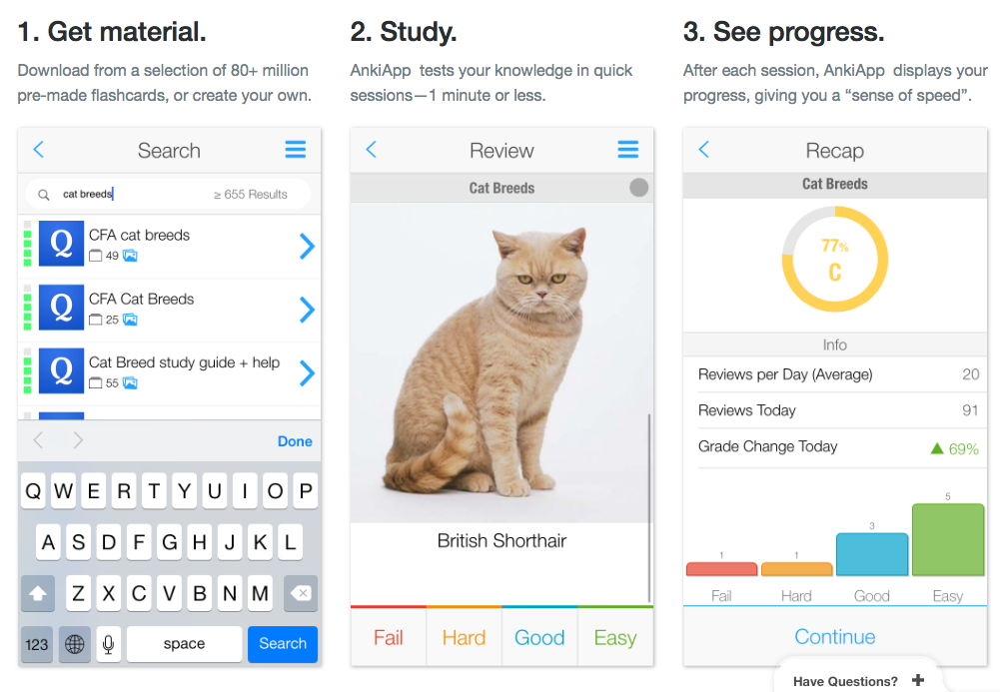
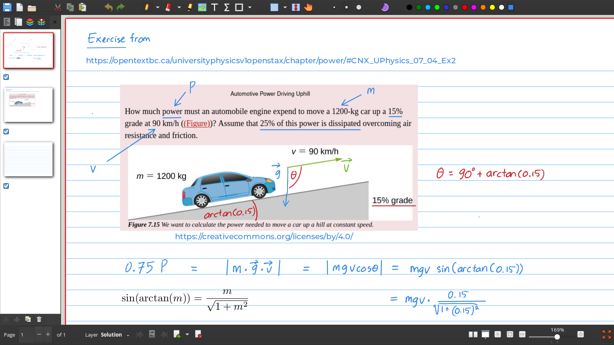
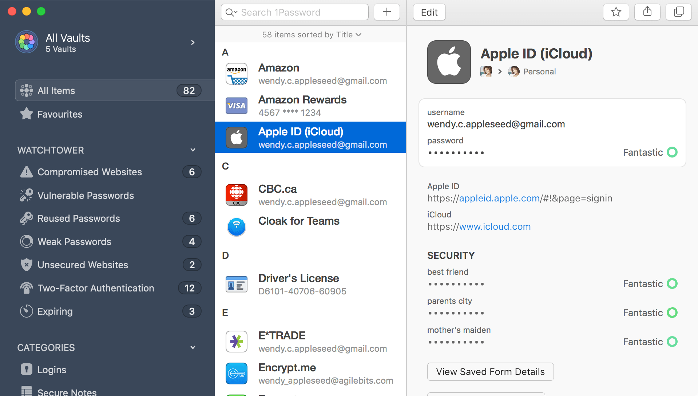

## My Minimalist Linux Workstation

I prioritize minimalism and simplicity to stay focused on what truly matters: my work. You won’t find any flashy or 
modern "unixporn" customizations here—just a clean, efficient setup designed to eliminate distractions and enhance 
productivity.

---

## Distro

> I tried multiple linux distros, but my heart goes to debian.
> 
> 

Debian is perfect for people who love stability and don't want their environment to change every year. You will miss all 
the "bleeding-edge" features in exchange for a stable environment that you can keep for multiple years without anything
ever breaking.

>**PS**: If you wish a more often updated environment while still being quite stable I would advise you to go look into 
Fedora. On the other hand, I wouldn't suggest using Ubuntu, as I've encountered various issues with it. Plus, why opt 
for a Debian-based fork that adds little value when Debian itself works perfectly well?
> 
---

## Desktop Environment

To continue my minimalist, focus-on-work journey, I had to choose GNOME as my desktop environment. It is quite similar 
to macOS in its approach. GNOME is elegant, fluid, and simple, yet it does everything you need it to do. It also works 
especially well on laptops, thanks to its dynamic desktop system.

---

## My Must-Have GNOME Extensions

- **Blur My Shell:** This extension adds a nice blur effect to your GNOME shell, giving your desktop a sleek, modern look. 
It enhances the aesthetics of your workspace by making the background of the top panel and activities overview 
semi-transparent, with an adjustable blur effect.

---

- **Dash to Dock:** This extension moves the dash out of the overview transforming it in a dock for an easier launching 
of applications and a faster switching between windows and desktops.
---

- **Forge:** An extension for automatic tiling, it offers a similar experience to tiling window managers like i3 or 
Wayland but without the steep learning curve. It allows for efficient multitasking by automatically snapping windows 
into a grid format, optimizing screen space for productivity.

---

- **Night Theme Switcher:** A simple app that allows you to set different wallpapers for Dark and Light themes.

---

- **Alphabetical App Grind:** This extension organizes your GNOME app grid in alphabetical order, making it easier to 
find applications.

---

- **AppIndicator and KStatusNotifierItem Support:** This extension adds support for system tray icons (AppIndicators), allowing apps that rely on these to work seamlessly within GNOME.

---

## My Go-to Apps

- **Notion:** By far my most used app. If I had to keep only one app, it would be Notion. I use it to organize all my 
life, from note-taking, task assignment, idea sheets, project management, resources, shopping lists, watchlists, etc.

---

- **My IDES:** Mostly PyCharm and PhpStorm, but sometimes also VSCode.

---

- **Anki:** A flashcard app, very useful when you have many things to memorize. It's easy to use throughout the day 
thanks to AnkiDroid. Anki uses spaced repetition, a great method to commit information to long-term memory.

---

- **Xournal++:** A handwriting note-taking app (you need a graphics tablet) that I mainly use for math or mind mapping to organize my thoughts.

---

- **1Password:** To store all my passwords in one place, allowing me to use a different complex password for each 
website without having to remember them. It saves me a lot of energy trying to recall my passwords.

You can add a markdown signature with a profile picture like this:

---
**Corentin Dupaigne**  
_Software Engineering student at Epita Paris_  
[LinkedIn](https://www.linkedin.com/in/corentin-dupaigne-b449a1242/) | [Portfolio](https://corentindupaigne.herokuapp.com)
---

